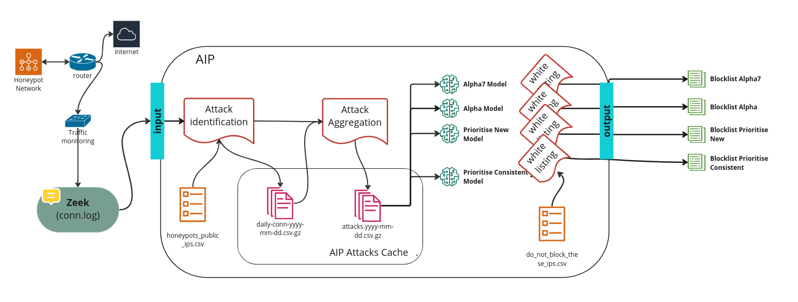

# Attacker IP Prioritization (AIP) Tool
The Attacker IP Prioritization (AIP) is a tool to generate efficient and economic IP blocklists based on network traffic captured from honeypot networks. 

With the advent of 5G, IoT devices are directly connected often without firewall protection. Therefore we need blocklists that are small, efficient and economic. The AIP structure is shown below.



## AIP Models

Each AIP model generates its own blocklist based on a specific criteria. The main models are:

1. **Prioritize New (PN)**
    - Focuses on IPs that are new or have not been seen frequently in previous data.
    - Useful to identify emerging attackers that are starting to target a network.
2. **Prioritize Consistent (PC)**
    - Focuses on IPs that have consistently attacked over time in previous data.
    - Useful to identify persistent attackers that continuously target a network.
3. **Alpha**
    - Provides a baseline identifying all attackers seen in the last 24 hours.
    - Useful to compare the effectiveness of other models.
4. **Alpha7**
    - Provides a baseline identifying all attackers seen in the last 7 days. 
    - Useful to further compare the effectiveness of other models.
5. **Random Forest**
    - Focuses on IPs that are more likely to attack in the future.
    - A more experimental approach to increase blocklist efficiency.


## AIP Docker

The best way to run AIP right now is using [Docker](etc/docker/README.md).

## Usage

AIP will automatically attempt to run all the models using the available data. Assuming the Zeek data is located in its usual location:

```bash
:~$ cd AIP
:~$ docker run --rm -v /opt/zeek/logs/:/home/aip/AIP/data/raw:ro -v ${PWD}/data/:/home/aip/AIP/data/:rw --name aip stratosphereips/aip:latest bin/aip
```

To run AIP for a specific day:
```bash
:~$ cd AIP
:~$ docker run --rm -v /opt/zeek/logs/:/home/aip/AIP/data/raw:ro -v ${PWD}/data/:/home/aip/AIP/data/:rw --name aip stratosphereips/aip:latest bin/aip YYYY-MM-DD
```

## License

The Stratosphere AIP tool is licensed under [GNU General Public License v3.0](https://github.com/stratosphereips/AIP/blob/main/LICENSE).

## About
This tool was developed at the Stratosphere Laboratory at the Czech Technical University in Prague. This is part of the [Stratosphere blocklist generation project](https://mcfp.felk.cvut.cz/publicDatasets/CTU-AIPP-BlackList/).